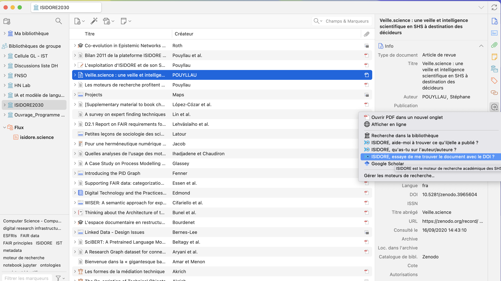
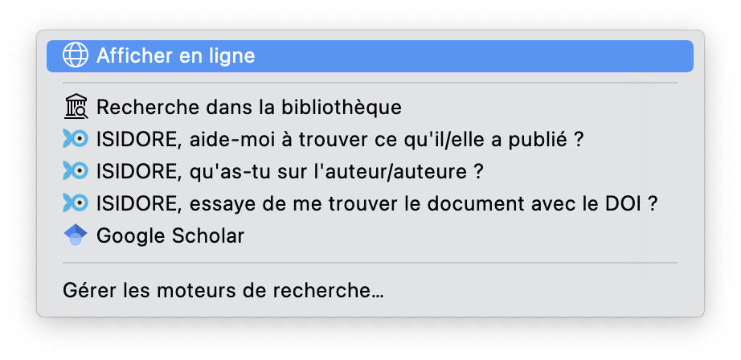

# Connecteurs ISIDORE pour Zotero

## Enrichir sa bibliothèque Zotero avec ISIDORE

[Zotero](https://zotero.org) permet d'utiliser des moteurs de recherche pour trouver ou completer des références bibliographiques. Nous proposons ici deux connecteurs pour Zotero permettant d'utiliser [ISIDORE](https://isidore.science) pour completer sa bibliothèque avec des références à partir de différentes recherches sur les auteurs.

### Fonctions

L'ajout d'ISIDORE à Zotero permet :

- De compléter des références à partir d'une recherche sur le nom de l'auteur ou de l'auteure : c'est le «ISIDORE, aide-moi à trouver ce qu'il/elle a publié.»
- De trouver des documents dans lequel l'auteure ou l'auteur est cité : c'est le «ISIDORE, qu'as-tu sur l'auteur/auteure ?»
- De trouver un document via son DOI (si le DOI a été indexé par ISIDORE)

### Fonctionnement

En sélectionnant une référence dans Zotero, il suffit d'ouvrir avec la flèche verte située à droite du champ de recherche des références :



Puis de sélectionner les liens "ISIDORE, ..." de votre choix :



Une fenêtre de votre navigateur s'ouvre alors avec la réponses proposées par ISIDORE.

### Installation :

#### Versions de Zotero

Ces connecteurs sont compatibles et ont été testés avec toutes [les versions suivantes de Zotero](https://www.zotero.org/support/changelog) :
- [x] Zotero 7.x (> mars 2023)
- [x] Zotero 6.0.x (> mars 2022)
- [x] > à Zotero 5.0.1 (> juillet 2017)

#### Version d'ISIDORE

Ces connecteurs sont compatibles avec [toutes les versions d'ISIDORE](https://isidore.science/releases).


#### Installation sur votre ordinateur

Fermez votre Zotero, Ouvrir le fichier <Zotero>/locate/engines.json (ex. sous Mac : Users/utilisateur/Zotero/locate ou voir https://www.zotero.org/support/zotero_data) dans un éditeur de texte (Atom, TextEdit, etc.) et ajoutez juste après le premier [ le code json contenu dans engines.json ou le code suivant :

```json
{
  "name": "ISIDORE, aide-moi à trouver ce qu'il/elle a publié.",
  "alias": "ISIDORE",
  "icon": "https://isidore.science/favicon.ico",
  "_urlTemplate": "https://isidore.science/s?q=author:\"{rft:aufirst?} {rft:aulast?}\"",
  "description": "ISIDORE est le moteur de recherche académique des SHS.",
  "hidden": false,
  "_urlParams": [],
  "_urlNamespaces": {
    "rft": "info:ofi/fmt:kev:mtx:journal",
    "z": "http://www.zotero.org/namespaces/openSearch#",
    "": "http://a9.com/-/spec/opensearch/1.1/"
  },
  "_iconSourceURI": "https://isidore.science/favicon.ico"
},
{
  "name": "ISIDORE, qu'as-tu sur l'auteur/auteure ?",
  "alias": "ISIDORE",
  "icon": "https://isidore.science/favicon.ico",
  "_urlTemplate": "https://isidore.science/s?q=\"{rft:aufirst?}+{rft:aulast?}\"",
  "description": "ISIDORE est le moteur de recherche académique des SHS.",
  "hidden": false,
  "_urlParams": [],
  "_urlNamespaces": {
    "rft": "info:ofi/fmt:kev:mtx:journal",
    "z": "http://www.zotero.org/namespaces/openSearch#",
    "": "http://a9.com/-/spec/opensearch/1.1/"
  },
  "_iconSourceURI": "https://isidore.science/favicon.ico"
},
{
  "_name": "ISIDORE, aurais-tu indexé le document avec le DOI ?",
  "_alias": "ISIDORE",
  "_description": "ISIDORE est le moteur de recherche académique des SHS.",
  "_icon": "https://isidore.science/favicon.ico",
  "_hidden": false,
  "_urlTemplate": "https://isidore.science/s?q=\"{z:DOI}\"",
  "_urlParams": [],
  "_urlNamespaces": {
    "rft": "info:ofi/fmt:kev:mtx:journal",
    "z": "http://www.zotero.org/namespaces/openSearch#",
    "": "http://a9.com/-/spec/opensearch/1.1/"
  },
  "_iconSourceURI": "https://isidore.science/favicon.ico"
	},
```

## English

Connectors are available for english people, please use engines_en.json.

## Español

Los conectores están disponibles en español.

## Crédits

Première version : août 2018.
Auteur : Stéphane Pouyllau -
Remerciements : Caroline Muller (pour les tests), Sean Takats, Laurent Capelli, Adrien Desseigne, Elifsu Sabuncu.
